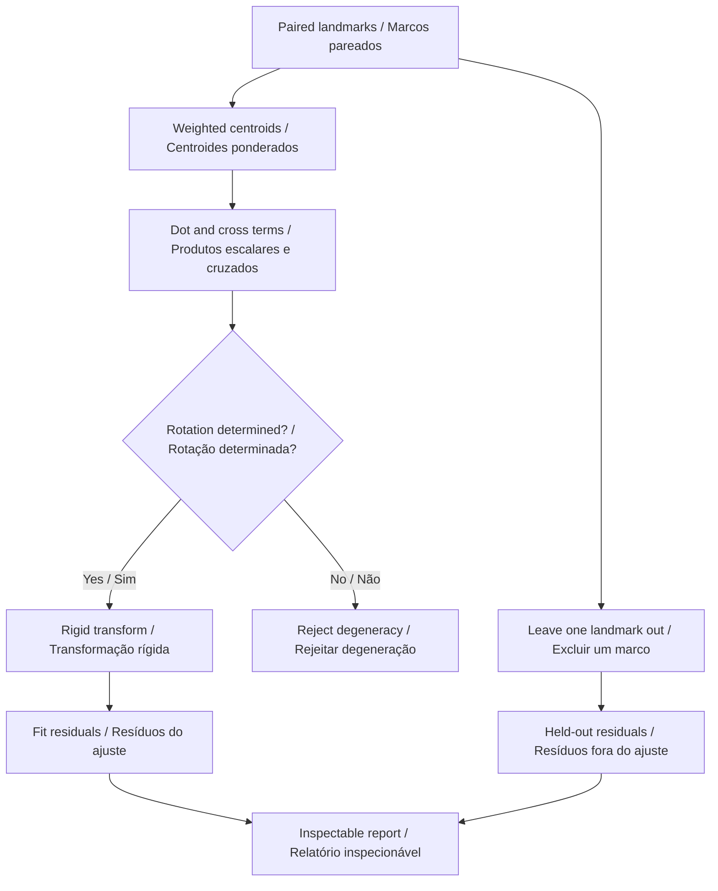
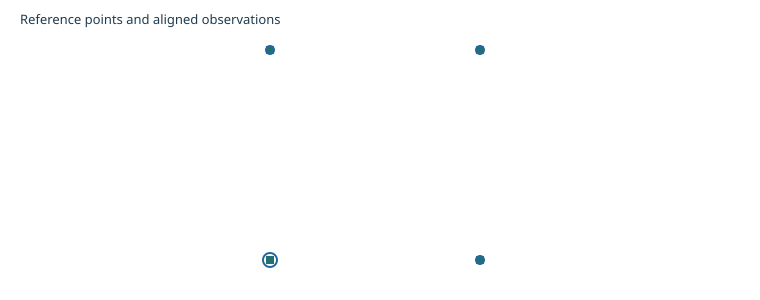
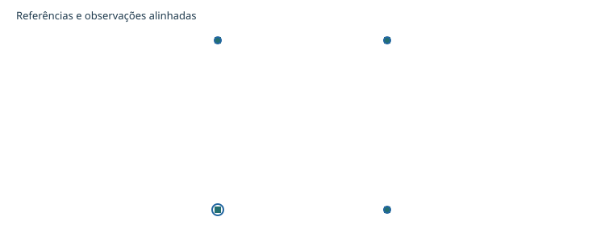

# Go2 PRO Sensor Alignment

**Align paired planar observations and inspect held-out residuals.**  
**Alinhe observações planas pareadas e inspecione resíduos fora do ajuste.**

[](https://github.com/galafis/go2-pro-sensor-alignment/actions/workflows/ci.yml) · **Working software prototype / Protótipo funcional** · **v0.1.1** · **29 automated tests / testes automatizados** · **MIT**

[English](#english) · [Português](#portugues) · [Live demo · Demonstração](https://galafis.github.io/go2-pro-sensor-alignment/) · [Five examples · Cinco exemplos](#examples)

## Workflow · Fluxo de trabalho



<a id="english"></a>

## English

A weighted least-squares fit of a proper two-dimensional rigid transform. It estimates rotation and translation from paired landmarks, reports residuals and recalculates fits with each landmark held out.

### Why this belongs in the Go2 PRO program

A route recorded in one coordinate frame cannot be compared directly with a floor plan in another. This workbench makes that alignment step inspectable for future Go2 PRO course observations. Known synthetic transformations show whether the implementation recovers a transform before any measured correspondences are introduced.

### Implemented behavior

- Compute weighted centroids of observed and reference landmarks, then center both point sets. Weights are explicit positive inputs, not inferred confidence values.
- Accumulate weighted dot and cross terms; the rotation angle is atan2(cross, dot). Translation maps the rotated observed centroid onto the reference centroid.
- Keep scale fixed at one and forbid reflection. Reject coincident or rotationally indeterminate correspondences instead of manufacturing a transform.
- For each landmark, report the fitted residual. With at least three landmarks, fit the remaining pairs and predict the omitted one. Retain unavailable held-out fits with an explicit reason.
- Report weighted fitted RMSE, maximum fitted residual and maximum available held-out residual separately. Evaluation points use the full fit and never alter its parameters.



### Run a complete experiment

Use **Node.js 22 or newer**. The application has no third-party runtime dependencies and does not require an account, API key or connected robot.

```sh
git clone https://github.com/galafis/go2-pro-sensor-alignment.git
cd go2-pro-sensor-alignment
npm test
npm run examples
npm start
```

Open **http://127.0.0.1:4173**. Select one of the five examples, change **Residual review threshold (m)**, and choose **Update**. Expand the JSON editor to edit the complete scenario. Inspect the chart, review cursor, findings and full-record preview. Export the scenario and report together; only the language preference is stored automatically.

The browser demo and command line use the same `run(scenario)` domain function:

```sh
node scripts/analyze.mjs examples/nominal.json report.json
npm run test:coverage
```

Exit codes are **0** for a completed analysis or review notes, **2** for a valid report requiring review, and **1** for invalid input. Code 2 still writes the report. Imported files are limited to 1 MB; malformed data does not replace the last valid browser result.

### Reproduce a result by hand

The nominal square is rotated 90° and translated by [3, 2] m. The fit recovers that transform with zero rounded residual. The evaluation point [1, 1] maps to [2, 3]. Perturbing one landmark exposes both fitted and held-out error; lowering its explicit weight changes the fit but does not erase that landmark's residual.

```text
angle = atan2(Σ w × cross(centeredObserved, centeredReference), Σ w × dot(centeredObserved, centeredReference))
translation = referenceCentroid - R(angle) × observedCentroid
alignedPoint = R(angle) × observedPoint + translation
```

The [worked examples](docs/EXPERIMENTS.md) list actual output metrics for all five scenarios. The [algorithm guide](docs/ARCHITECTURE.md) explains the calculation and event flow; the [data contract](docs/DATA_CONTRACT.md) specifies fields, units, limits and semantic checks.

### Validation and interpretation

Tests check known answers, boundary cases, deterministic behavior and failure handling. They also exercise the command line and bilingual chart generation. [Validation notes](docs/VALIDATION.md) link the test files and explain what they establish. Example reports are committed so a changed algorithm produces a reviewable difference.

The method does not estimate scale, 3D pose, time synchronization or lens distortion. It assumes correct landmark identities and a rigid planar relation. Small fitted error can be misleading with poor geometry or reused observations; held-out residuals are a diagnostic, not an independent field validation.

### From a prototype to a controlled study

Mark well-separated landmarks and document units and axis orientation. Keep a separate set of check points that is not used for fitting. Record correspondence selection and weighting rules before inspecting results. Compare held-out and independent check-point errors, and preserve failed or degenerate fits.

The current release is independent of physical hardware. The [Go2 PRO development plan](docs/GO2_PRO_PLAN.md) separates software that works now from interface confirmation and physical measurements. A standard PRO configuration must not be assumed to expose custom development interfaces; confirm the exact supported configuration with Unitree.

Related work: [go2-pro-telemetry-replay](https://github.com/galafis/go2-pro-telemetry-replay). See [integration notes](docs/INTEGRATION.md) for implemented exchange and remaining boundaries.

<a id="portugues"></a>

## Português

Um ajuste ponderado por mínimos quadrados de uma transformação rígida própria em duas dimensões. Estima rotação e translação a partir de marcos pareados, informa resíduos e recalcula ajustes excluindo cada marco.

### Por que este projeto pertence ao programa com o Go2 PRO

Uma rota registrada em um sistema de coordenadas não pode ser comparada diretamente com uma planta em outro. A bancada torna o alinhamento inspecionável para futuras observações de percursos com o Go2 PRO. Transformações sintéticas conhecidas mostram se a implementação recupera o ajuste antes de introduzir correspondências medidas.

### Comportamentos implementados

- Calcule centroides ponderados dos marcos observados e de referência e centralize ambos os conjuntos. Pesos são entradas positivas explícitas, não valores de confiança inferidos.
- Acumule termos ponderados de produto escalar e cruzado; o ângulo é atan2(cruzado, escalar). A translação leva o centroide observado rotacionado ao centroide de referência.
- Mantenha escala um e proíba reflexão. Rejeite correspondências coincidentes ou sem rotação determinada, sem fabricar uma transformação.
- Para cada marco, informe o resíduo do ajuste. Com pelo menos três marcos, ajuste os demais e preveja o excluído. Preserve ajustes de exclusão indisponíveis com motivo explícito.
- Informe separadamente RMSE ponderado do ajuste, maior resíduo ajustado e maior resíduo de exclusão disponível. Pontos de avaliação usam o ajuste completo e nunca alteram seus parâmetros.



### Executar um experimento completo

Use **Node.js 22 ou superior**. A aplicação não possui dependências externas em tempo de execução e não exige conta, chave de acesso ou robô conectado.

```sh
git clone https://github.com/galafis/go2-pro-sensor-alignment.git
cd go2-pro-sensor-alignment
npm test
npm run examples
npm start
```

Abra **http://127.0.0.1:4173**. Selecione um dos cinco exemplos, altere **Limiar de revisão do resíduo (m)** e escolha **Atualizar**. Expanda o editor JSON para editar o cenário completo. Inspecione gráfico, cursor de revisão, achados e prévia dos registros. Exporte cenário e relatório juntos; apenas a preferência de idioma é armazenada automaticamente.

A demonstração no navegador e a linha de comando usam a mesma função de domínio `run(scenario)`:

```sh
node scripts/analyze.mjs examples/nominal.json report.json
npm run test:coverage
```

Os códigos de saída são **0** para análise concluída ou notas de revisão, **2** para relatório válido que exige revisão e **1** para entrada inválida. O código 2 também grava o relatório. Arquivos importados são limitados a 1 MB; dados inválidos não substituem o último resultado válido no navegador.

### Reproduzir um resultado manualmente

O quadrado nominal é rotacionado 90° e transladado por [3, 2] m. O ajuste recupera essa transformação com resíduo arredondado zero. O ponto de avaliação [1, 1] passa a [2, 3]. Perturbar um marco evidencia erro ajustado e de exclusão; reduzir seu peso explícito altera o ajuste, mas não apaga o resíduo desse marco.

As fórmulas acima usam as unidades explicitadas no [contrato de dados](docs/DATA_CONTRACT.md). Os [experimentos comentados](docs/EXPERIMENTS.md) mostram métricas reais de saída dos cinco cenários. O [guia de arquitetura](docs/ARCHITECTURE.md) explica o cálculo e o fluxo de eventos.

### Validação e interpretação

Os testes verificam respostas conhecidas, casos de fronteira, comportamento determinístico e tratamento de falhas. Também exercitam a linha de comando e a geração dos gráficos bilíngues. As [notas de validação](docs/VALIDATION.md) apontam os arquivos de teste e explicam o que comprovam. Relatórios de exemplo são versionados para que alterações do algoritmo produzam diferenças revisáveis.

O método não estima escala, pose 3D, sincronização temporal ou distorção de lente. Pressupõe identidades corretas dos marcos e relação plana rígida. Erro ajustado pequeno pode enganar com geometria inadequada ou observações reutilizadas; resíduos de exclusão são diagnóstico, não validação de campo independente.

### Do protótipo ao estudo controlado

Marque pontos bem separados e documente unidades e orientação dos eixos. Mantenha pontos independentes de verificação fora do ajuste. Registre regras de correspondência e pesos antes de inspecionar resultados. Compare erros de exclusão e de pontos independentes e preserve ajustes falhos ou degenerados.

A versão atual funciona independentemente de hardware físico. O [plano de desenvolvimento com o Go2 PRO](docs/GO2_PRO_PLAN.md) separa software funcional de confirmação de interfaces e medições físicas. Não se deve presumir que uma configuração PRO padrão exponha interfaces de desenvolvimento personalizado; confirme a configuração compatível exata com a Unitree.

Trabalho relacionado: [go2-pro-telemetry-replay](https://github.com/galafis/go2-pro-telemetry-replay). Consulte as [notas de integração](docs/INTEGRATION.md) para trocas implementadas e limites restantes.

<a id="examples"></a>

## Reproducible examples · Exemplos reproduzíveis

| Scenario · Cenário                                                  | Input · Entrada                         | Expected report · Relatório esperado                  | Status         |
| ------------------------------------------------------------------- | --------------------------------------- | ----------------------------------------------------- | -------------- |
| Known rotation and translation<br>Rotação e translação conhecidas   | [nominal.json](examples/nominal.json)   | [nominal.report.json](examples/nominal.report.json)   | `complete`     |
| Small observation perturbation<br>Pequena perturbação da observação | [noise.json](examples/noise.json)       | [noise.report.json](examples/noise.report.json)       | `complete`     |
| Mismatched landmark<br>Correspondência incorreta                    | [outlier.json](examples/outlier.json)   | [outlier.report.json](examples/outlier.report.json)   | `review-notes` |
| Explicit lower weight<br>Peso menor explícito                       | [weighted.json](examples/weighted.json) | [weighted.report.json](examples/weighted.report.json) | `review-notes` |
| Minimum two correspondences<br>Mínimo de duas correspondências      | [minimal.json](examples/minimal.json)   | [minimal.report.json](examples/minimal.report.json)   | `review-notes` |

## Repository guide · Guia do repositório

| File · Arquivo                                 | Purpose · Objetivo                                                                                   |
| ---------------------------------------------- | ---------------------------------------------------------------------------------------------------- |
| [src/engine.js](src/engine.js)                 | Domain implementation / Implementação de domínio                                                     |
| [test/](test/)                                 | Numerical, behavioral and integration checks / Verificações numéricas, de comportamento e integração |
| [docs/ARCHITECTURE.md](docs/ARCHITECTURE.md)   | Algorithms and Mermaid sequence / Algoritmos e sequência Mermaid                                     |
| [docs/DATA_CONTRACT.md](docs/DATA_CONTRACT.md) | Fields, units, validation / Campos, unidades, validação                                              |
| [docs/EXPERIMENTS.md](docs/EXPERIMENTS.md)     | Worked examples / Exemplos comentados                                                                |
| [docs/VALIDATION.md](docs/VALIDATION.md)       | Evidence and test boundaries / Evidências e limites dos testes                                       |
| [docs/GO2_PRO_PLAN.md](docs/GO2_PRO_PLAN.md)   | Platform development stages / Etapas de desenvolvimento com a plataforma                             |
| [CONTRIBUTING.md](CONTRIBUTING.md)             | Reproducible contributions / Contribuições reproduzíveis                                             |
| [SECURITY.md](SECURITY.md)                     | Local data handling / Tratamento local dos dados                                                     |

Maintainer / Responsável: **Gabriel Demetrios Lafis** · [gabrieldemetrioslafis@usp.br](mailto:gabrieldemetrioslafis@usp.br)

Independent public research prototype. No vendor or institutional endorsement is claimed. / Protótipo público independente de pesquisa. Não se afirma endosso do fabricante ou institucional.
