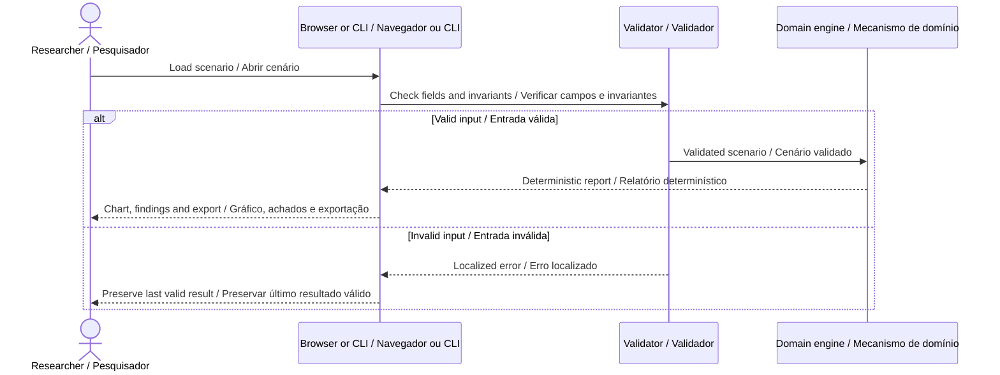

# Architecture · Arquitetura

[README](../README.md) · [Contract / Contrato](DATA_CONTRACT.md)



## English

A weighted least-squares fit of a proper two-dimensional rigid transform. It estimates rotation and translation from paired landmarks, reports residuals and recalculates fits with each landmark held out.

1. Compute weighted centroids of observed and reference landmarks, then center both point sets. Weights are explicit positive inputs, not inferred confidence values.

2. Accumulate weighted dot and cross terms; the rotation angle is atan2(cross, dot). Translation maps the rotated observed centroid onto the reference centroid.

3. Keep scale fixed at one and forbid reflection. Reject coincident or rotationally indeterminate correspondences instead of manufacturing a transform.

4. For each landmark, report the fitted residual. With at least three landmarks, fit the remaining pairs and predict the omitted one. Retain unavailable held-out fits with an explicit reason.

5. Report weighted fitted RMSE, maximum fitted residual and maximum available held-out residual separately. Evaluation points use the full fit and never alter its parameters.

```text
angle = atan2(Σ w × cross(centeredObserved, centeredReference), Σ w × dot(centeredObserved, centeredReference))
translation = referenceCentroid - R(angle) × observedCentroid
alignedPoint = R(angle) × observedPoint + translation
```

The engine receives plain JSON and returns plain data. It has no browser, network or private-core dependency. Validation finishes before computation. Reports preserve the source label and analysis version, omit wall-clock timestamps and can be compared byte-for-byte after formatting. The browser uses a revision counter to prevent an older import from replacing a newer result. Every displayed external string is escaped.

## Português

Um ajuste ponderado por mínimos quadrados de uma transformação rígida própria em duas dimensões. Estima rotação e translação a partir de marcos pareados, informa resíduos e recalcula ajustes excluindo cada marco.

1. Calcule centroides ponderados dos marcos observados e de referência e centralize ambos os conjuntos. Pesos são entradas positivas explícitas, não valores de confiança inferidos.

2. Acumule termos ponderados de produto escalar e cruzado; o ângulo é atan2(cruzado, escalar). A translação leva o centroide observado rotacionado ao centroide de referência.

3. Mantenha escala um e proíba reflexão. Rejeite correspondências coincidentes ou sem rotação determinada, sem fabricar uma transformação.

4. Para cada marco, informe o resíduo do ajuste. Com pelo menos três marcos, ajuste os demais e preveja o excluído. Preserve ajustes de exclusão indisponíveis com motivo explícito.

5. Informe separadamente RMSE ponderado do ajuste, maior resíduo ajustado e maior resíduo de exclusão disponível. Pontos de avaliação usam o ajuste completo e nunca alteram seus parâmetros.

O mecanismo recebe JSON simples e retorna dados simples. Não depende do navegador, rede ou núcleo privado. A validação termina antes do cálculo. Relatórios preservam origem e versão, omitem horários reais de execução e podem ser comparados após formatação. O navegador usa um contador de revisão para impedir que uma importação antiga substitua resultado mais recente. Todo texto externo exibido passa por escape.

## Module boundaries · Limites dos módulos

| Module · Módulo       | Responsibility · Responsabilidade                                                   |
| --------------------- | ----------------------------------------------------------------------------------- |
| `engine.js`           | Validated domain calculation / Cálculo de domínio validado                          |
| `validation.js`       | Strict primitives and report envelope / Validações estritas e envelope do relatório |
| `view.js`             | Domain chart and interpretation / Gráfico e interpretação do domínio                |
| `app.js`              | Import, language, controls and export / Importação, idioma, controles e exportação  |
| `ui.js`               | Escaping, numbers and downloads / Escape, números e downloads                       |
| `scripts/analyze.mjs` | Command-line entry point / Entrada por linha de comando                             |

## Residual threshold precision · Precisão do limiar de resíduos

Threshold decisions compare full-precision fitted and held-out residuals. Only displayed/exported metrics are rounded to six decimals. A finding can therefore accompany a displayed value equal to the threshold when the unrounded residual is slightly greater. Regression tests check both sides of this boundary.

As decisões comparam resíduos do ajuste e de exclusão com precisão completa. Apenas métricas exibidas/exportadas são arredondadas a seis casas. Por isso, um aviso pode acompanhar um valor exibido igual ao limiar se o resíduo sem arredondamento for ligeiramente maior. Testes de regressão verificam os dois lados desse limite.
