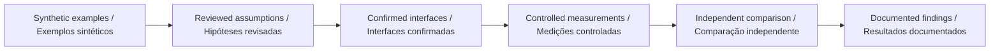

# Go2 PRO development plan · Plano de desenvolvimento com o Go2 PRO

## English

A route recorded in one coordinate frame cannot be compared directly with a floor plan in another. This workbench makes that alignment step inspectable for future Go2 PRO course observations. Known synthetic transformations show whether the implementation recovers a transform before any measured correspondences are introduced.

Mark well-separated landmarks and document units and axis orientation. Keep a separate set of check points that is not used for fitting. Record correspondence selection and weighting rules before inspecting results. Compare held-out and independent check-point errors, and preserve failed or degenerate fits.

## Português

Uma rota registrada em um sistema de coordenadas não pode ser comparada diretamente com uma planta em outro. A bancada torna o alinhamento inspecionável para futuras observações de percursos com o Go2 PRO. Transformações sintéticas conhecidas mostram se a implementação recupera o ajuste antes de introduzir correspondências medidas.

Marque pontos bem separados e documente unidades e orientação dos eixos. Mantenha pontos independentes de verificação fora do ajuste. Registre regras de correspondência e pesos antes de inspecionar resultados. Compare erros de exclusão e de pontos independentes e preserve ajustes falhos ou degenerados.

| Stage · Etapa                                                     | Current evidence / Evidência atual                                                                     | Completion condition / Condição de conclusão                                                                 |
| ----------------------------------------------------------------- | ------------------------------------------------------------------------------------------------------ | ------------------------------------------------------------------------------------------------------------ |
| Software model / Modelo de software                               | Implemented, with tests and reproducible scenarios / Implementado, com testes e cenários reproduzíveis | Review the domain assumptions / Revisar hipóteses do domínio                                                 |
| Platform configuration / Configuração da plataforma               | Pending exact interface confirmation / Pendente de confirmação exata das interfaces                    | Written configuration and interface compatibility / Compatibilidade documentada de configuração e interfaces |
| Adapter / Adaptador                                               | No vendor/device adapter in this release / Sem adaptador de fabricante/dispositivo nesta versão        | Separate implementation and interface tests / Implementação e testes de interface próprios                   |
| Physical measurements / Medições físicas                          | Not performed by this repository / Não realizadas por este repositório                                 | Controlled protocol and independent measurements / Protocolo controlado e medições independentes             |
| Participant or field study / Estudo com participantes ou em campo | Not established / Não estabelecido                                                                     | Separate study design and applicable review / Desenho de estudo e revisão aplicável próprios                 |

## Configuration evidence · Evidência de configuração

The [official Go2 page](https://www.unitree.com/go2/) distinguishes configurations; its comparison lists secondary development for EDU and marks it unavailable for the standard PRO. The existence of [Unitree SDK2](https://github.com/unitreerobotics/unitree_sdk2) does not establish access for a particular PRO unit. Confirm supported interfaces and commercial configuration directly before device work. Reviewed on 2026-09-10.

A [página oficial do Go2](https://www.unitree.com/go2/) distingue configurações; sua comparação lista desenvolvimento secundário para EDU e o marca indisponível no PRO padrão. A existência do [Unitree SDK2](https://github.com/unitreerobotics/unitree_sdk2) não comprova acesso em uma unidade PRO específica. Confirme interfaces e configuração comercial diretamente antes do trabalho com o dispositivo. Revisado em 10/09/2026.

The prototype's scientific usefulness does not depend on claiming unsupported interfaces: it can structure hypotheses and analyze separately collected observations. / A utilidade científica do protótipo não depende de afirmar interfaces sem suporte: ele estrutura hipóteses e analisa observações coletadas separadamente.
