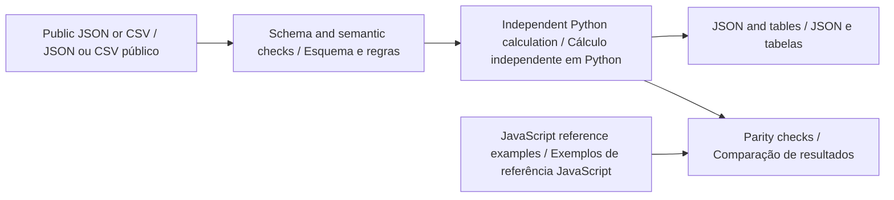

# Python offline guide · Guia Python offline

[English](#english) · [Português](#portugues) · [Project / Projeto](../README.md)

**Python companion v0.2.0 · Python 3.11+ · Python · JavaScript**



<a id="english"></a>

## English

Fit a weighted 2D rotation and translation from CSV landmark correspondences. Review fitted residuals, leave-one-out residuals and transformed evaluation points before comparing different observation coordinate frames.

### Install and run

From the repository root, create a virtual environment with `python -m venv .venv`. Activate it with `.venv\Scripts\Activate.ps1` in PowerShell or `source .venv/bin/activate` in a Unix shell. Use `python3` instead of `python` if required by your installation.

```sh
python -m pip install -r requirements-python.txt .
python -m go2_alignment --help
python -m go2_alignment analyze examples/nominal.json review-output/nominal.report.json
python -m go2_alignment import-csv examples/nominal.json examples/python/input.csv review-output/imported.scenario.json
python -m go2_alignment analyze review-output/imported.scenario.json review-output/imported.report.json
```

The first analysis creates `review-output/`. Use a new SQLite filename for a new archive, when applicable. Reimporting the same scenario identifier is rejected to preserve the previous record. Runtime calculations require Python and the declared schema-validation dependencies; Node is needed only for the browser application and cross-language tests.

### Method and worked example

Weighted centroids remove translation. A dot/cross formulation gives the proper planar rotation at fixed unit scale. Coincident or rotationally indeterminate correspondences are rejected. Each leave-one-out fit excludes the tested pair; with two pairs it is explicitly unavailable. Threshold decisions use full precision before report rounding.

```text
angle = atan2(weightedCross, weightedDot)
translation = referenceCentroid - rotation(observedCentroid)
aligned = rotation(observed) + translation
```

The CSV contains a known synthetic rotation and translation. Import it, run analyze and compare nominal.report.json with imported.report.json. Five shared browser fixtures additionally cover perturbation, a mismatched landmark, unequal weights and the minimum two-point case.

Browse the [committed inputs and outputs](../examples/python/README.md). CSV column order and names must match the example header exactly. Missing columns, extra columns, malformed numbers, duplicate identifiers and non-finite values are rejected where applicable. JSON rejects unknown fields and duplicate object keys. The public [scenario schema](../schemas/scenario.schema.json) defines units and field bounds; the domain module adds relationships that JSON Schema alone cannot express.

### Use as a library

```python
from pathlib import Path
from go2_alignment import analyze
from go2_alignment.contract import read_json

scenario = read_json(Path("examples/nominal.json"))
result = analyze(scenario)
print(result["scenarioId"])
```

See the [calculation module](../python/go2_alignment/core.py) and [CLI](../python/go2_alignment/__main__.py). The Python result is a documented offline summary, not the complete bilingual browser report envelope. Shared numerical fields and paths are independently compared; matching output is a software consistency check, not physical validation.

### Verify

Install Node.js 22+ for the independent JavaScript comparisons, then run:

```sh
python -m unittest discover -s python/tests -v
python scripts/check-python-examples.py
npm test
```

The Python suite covers the strict public contract, unchanged inputs, invalid-file handling, preservation of previous outputs, domain boundaries and every canonical example listed in `examples/index.json`. The example checker executes the documented workflows in a temporary directory and compares JSON/CSV artifacts. Use its `--write` option only after intentionally reviewing a changed result. CLI exit status is 0 for a completed calculation and 1 for invalid input or a failed integrity check. Inspect result flags for review conditions; this differs from the browser CLI's status-2 convention.

### Interpretation boundary

This is a planar, unit-scale fit. It does not calibrate a 3D sensor, estimate time synchronization, handle reflection or establish physical localization accuracy. Leave-one-out residuals are descriptive checks, not independent field validation.

Go2 PRO remains the proposed observation platform. These tools contain no robot commands, and custom SDK support on standard PRO hardware is not assumed. See the [hardware study plan](GO2_PRO_PLAN.md).

<a id="portugues"></a>

## Português

Ajuste rotação e translação 2D ponderadas a partir de correspondências de marcos em CSV. Revise resíduos do ajuste, resíduos por exclusão de um ponto e pontos de avaliação transformados antes de comparar sistemas de coordenadas de observações.

### Instalação e execução

Na raiz do repositório, crie o ambiente com `python -m venv .venv`. Ative com `.venv\Scripts\Activate.ps1` no PowerShell ou `source .venv/bin/activate` em um shell Unix. Use `python3` se essa for a nomenclatura da instalação. Execute a sequência de comandos da seção inglesa: ela é a mesma nos dois idiomas. A primeira análise cria `review-output/`.

Instale com `python -m pip install -r requirements-python.txt .`. Os cálculos dependem de Python e das dependências declaradas para validação de esquema. Node.js 22+ é necessário somente para o aplicativo de navegador e para os testes entre linguagens. Quando houver SQLite, use um arquivo novo para um novo arquivo de análise; identificadores de cenário repetidos são rejeitados, preservando os registros existentes.

### Método e exemplo explicado

Centroides ponderados removem a translação. Uma formulação por produtos escalar e vetorial fornece a rotação plana própria com escala unitária fixa. Correspondências coincidentes ou sem rotação determinada são rejeitadas. Cada ajuste por exclusão retira o par avaliado; com dois pares ele fica explicitamente indisponível. Decisões de limiar usam precisão completa antes do arredondamento.

O CSV contém rotação e translação sintéticas conhecidas. Importe, execute analyze e compare nominal.report.json com imported.report.json. Cinco exemplos compartilhados com o navegador também cobrem perturbação, marco incorreto, pesos desiguais e o caso mínimo de dois pontos.

As fórmulas e os comandos acima usam nomes de campos estáveis, compartilhados pelos dois idiomas. Consulte as [entradas e saídas versionadas](../examples/python/README.md). Cabeçalhos CSV devem corresponder exatamente ao exemplo, incluindo a ordem. Colunas ausentes ou extras, números malformados, identificadores duplicados e valores não finitos são rejeitados quando aplicável. JSON rejeita campos desconhecidos e chaves repetidas. O [esquema público](../schemas/scenario.schema.json) define unidades e limites; o módulo de domínio valida relações adicionais.

### Biblioteca e validação

O exemplo Python da seção inglesa funciona diretamente. O [módulo de cálculo](../python/go2_alignment/core.py) retorna um resumo offline documentado; ele não replica todo o envelope bilíngue do relatório de navegador. Os campos numéricos e caminhos compartilhados são comparados independentemente. Concordância é uma verificação de consistência do software, não validação física.

Execute `python -m unittest discover -s python/tests -v`, `python scripts/check-python-examples.py` e `npm test`. A suíte Python cobre o contrato, preservação de entradas, arquivos inválidos, manutenção da saída anterior, limites do domínio e todos os exemplos canônicos do índice. O verificador executa os fluxos em diretório temporário e compara os artefatos JSON/CSV. Use `--write` somente após revisar uma mudança intencional. O código de saída é 0 para cálculo concluído e 1 para entrada inválida ou falha de integridade. Consulte as sinalizações do resultado; a convenção difere do código 2 da interface de análise em JavaScript.

### Limites de interpretação

Este é um ajuste plano com escala unitária. Não calibra um sensor 3D, estima sincronização temporal, trata reflexão nem estabelece precisão física de localização. Resíduos por exclusão são verificações descritivas, não validação de campo independente.

O Go2 PRO continua como plataforma proposta de observação. Estas ferramentas não contêm comandos de robô nem pressupõem suporte a SDK personalizado no PRO padrão. Consulte o [plano de estudo com hardware](GO2_PRO_PLAN.md).
